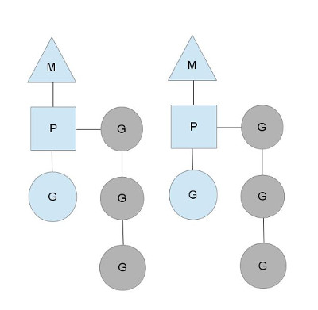
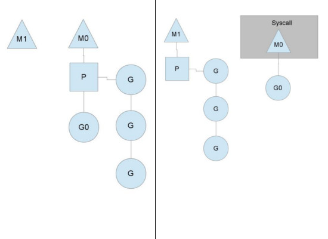

# 进程、线程和协程

###### 要理解什么是goroutine，我们先来看看进程、线程以及协程它们之间的区别，这能帮助我们更好的理解goroutine。
- **进程**：分配完整独立的地址空间，拥有自己独立的堆和栈，既不共享堆，亦不共享栈，进程的切换只发生在内核态，由操作系统调度。
- **线程**：和其它本进程的线程共享地址空间，拥有自己独立的栈和共享的堆，共享堆，不共享栈，线程的切换一般也由操作系统调度(标准线程是的)。
- **协程**：和线程类似，共享堆，不共享栈，协程的切换一般由程序员在代码中显式控制。

进程和线程的切换主要依赖于时间片的控制（关于进程和线程的调度方式，具体可参看这篇文章：[进程线程调度方式](http://blog.chinaunix.net/uid-20476365-id-1942505.html)），而协程的切换则主要依赖于自身，这样的好处是避免了无意义的调度，由此可以提高性能，但也因此，程序员必须自己承担调度的责任。
goroutine可以看作是协程的go语言实现，从百度百科上看协程的定义：与子例程一样，协程（coroutine）也是一种程序组件。相对子例程而言，协程更为一般和灵活，但在实践中使用没有子例程那样广泛。实际上，我们可以把子例程当作是协程的一种特例。一般来说，如果没有显式的让出CPU，就会一直执行当前协程。
#### 浅析goroutine
我们知道goroutine是协程的go语言实现，它是语言原生支持的，相对于一般由库实现协程的方式，goroutine更加强大，它的调度一定程度上是由go运行时（runtime）管理。其好处之一是，当某goroutine发生阻塞时（例如同步IO操作等），会自动出让CPU给其它goroutine。
goroutine的使用非常简单，例如foo是一个函数：`go foo()` 就一个关键字go搞定了，这里会启动一个goroutine执行foo函数，然后CPU继续执行后面的代码。这里虽然启动了goroutine，但并不意味着它会得到马上调度，关于goroutine的调度我们稍后再探讨。
goroutine是非常轻量级的，它就是一段代码，一个函数入口，以及在堆上为其分配的一个堆栈（初始大小为4K，会随着程序的执行自动增长删除）。所以它非常廉价，我们可以很轻松的创建上万个goroutine。
#### go运行时调度
默认的, 所有goroutine会在一个原生线程里跑，也就是只使用了一个CPU核。在同一个原生线程里，如果当前goroutine不发生阻塞，它是不会让出CPU时间给其他同线程的goroutines的。除了被系统调用阻塞的线程外，Go运行库最多会启动*$GOMAXPROCS*个线程来运行goroutine。
那么goroutine究竟是如何被调度的呢?我们从go程序启动开始说起。在go程序启动时会首先创建一个特殊的内核线程sysmon，从名字就可以看出来它的职责是负责监控的，goroutine背后的调度可以说就是靠它来搞定。
接下来，我们再看看它的调度模型，go语言当前的实现是N:M。即一定数量的用户线程映射到一定数量的OS线程上，这里的用户线程在go中指的就是goroutine。go语言的调度模型需要弄清楚三个概念：M、P和G，如下图表示： 

M代表OS线程，G代表goroutine，P的概念比较重要，它表示执行的上下文，其数量由*$GOMAXPROCS*决定，一般来说正好等于处理器的数量。M必须和P绑定才能执行G，调度器需要保证所有的P都有G执行，以保证并行度。如下图： 

从图中我们可以看见，当前有两个P，各自绑定了一个M，并分别执行了一个goroutine，我们还可以看见每个P上还挂了一个G的队列，这个队列是代表私有的任务队列，它们实际上都是runnable状态的goroutine。当使用go关键字声明时,一个goroutine便被加入到运行队列的尾部。一旦一个goroutine运行到一个调度点,上下文便从运行队列中取出一个goroutine, 设置好栈和指令指针,便开始运行新的goroutine。

###### 那么go中切换goroutine的调度点有哪些呢？具体有以下三种情况
- 调用runtime·gosched函数。goroutine主动放弃CPU，该goroutine会被设置为runnable状态，然后放入一个全局等待队列中，而P将继续执行下一个goroutine。使用runtime·gosched函数是一个主动的行为，一般是在执行长任务时又想其它goroutine得到执行的机会时调用。
- 调用runtime·park函数。goroutine进入waitting状态，除非对其调用runtime·ready函数，否则该goroutine将永远不会得到执行。而P将继续执行下一个goroutine。使用runtime·park函数一般是在某个条件如果得不到满足就不能继续运行下去时调用，当条件满足后需要使用runtime·ready以唤醒它（这里唤醒之后是否会加入全局等待队列还有待研究）。像channel操作，定时器中，网络poll等都有可能park goroutine。
- 慢系统调用。这样的系统调用会阻塞等待，为了使该P上挂着的其它G也能得到执行的机会，需要将这些goroutine转到另一个OS线程上去。具体的做法是：首先将该P设置为syscall状态，然后该线程进入系统调用阻塞等待。之前提到过的sysmom线程会定期扫描所有的P，发现一个P处于了syscall的状态，就将M和P分离（实际上只有当 Syscall 执行时间超出某个阈值时，才会将 M 与 P 分离）。RUNTIME会再分配一个M和这个P绑定，从而继续执行队列中的其它G。而当之前阻塞的M从系统调用中返回后，会将该goroutine放入全局等待队列中，自己则sleep去。 

该图描述了M和P的分离过程。
调度点的情况说清楚了，但整个模型还并不完整。我们知道当使用go去调用一个函数，会生成一个新的goroutine放入当前P的队列中，那么什么时候生成别的OS线程，各个OS线程又是如何做负载均衡的呢？
当M从队列中拿到一个可执行的G后，首先会去检查一下，自己的队列中是否还有等待的G，如果还有等待的G，并且也还有空闲的P，此时就会通知runtime分配一个新的M（如果有在睡觉的OS线程，则直接唤醒它，没有的话则生成一个新的OS线程）来分担任务。
如果某个M发现队列为空之后，会首先从全局队列中取一个G来处理。如果全局队列也空了，则会随机从别的P那里直接截取一半的队列过来（偷窃任务），如果发现所有的P都没有可供偷窃的G了，该M就会陷入沉睡。
整个调度模型大致就是这样子了，和所有协程的调度一样，在响应时间上，这种协作式调度是硬伤。很容易导致某个协程长时间无法得到执行。但总体来说，它带来的好处更加让人惊叹。想要了解的更多可以看看我下面列出的一些参考资料，或是直接看它的源码：[http://golang.org/src/runtime/proc.c](https://golang.google.cn/src/runtime/proc.go)

---
[理解goroutine](http://blog.csdn.net/justaipanda/article/details/44064811)