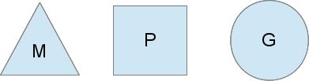
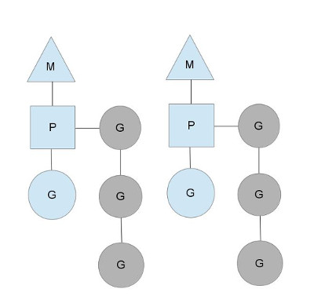
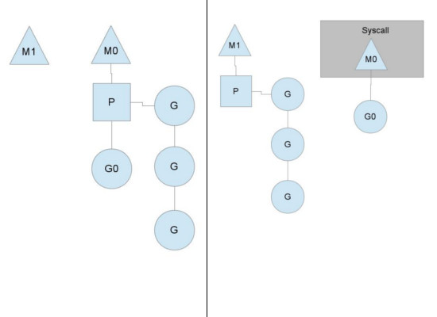

# 进程、线程和协程

要理解什么是 goroutine，我们先来看看进程、线程以及协程它们之间的区别，这能帮助我们更好的理解 goroutine。

- **进程**：分配完整独立的地址空间，拥有自己独立的堆和栈，既不共享堆，亦不共享栈，进程的切换只发生在内核态，由操作系统调度。
- **线程**：和其它本进程的线程共享地址空间，拥有自己独立的栈和共享的堆，共享堆，不共享栈，线程的切换一般也由操作系统调度(标准线程是的)。
- **协程**：和线程类似，共享堆，不共享栈，协程的切换一般由程序员在代码中显式控制。

进程和线程的切换主要依赖于时间片的控制（关于进程和线程的调度方式，具体可参看这篇文章：[进程线程调度方式](http://blog.chinaunix.net/uid-20476365-id-1942505.html)），而协程的切换则主要依赖于自身，这样的好处是避免了无意义的调度，由此可以提高性能，但也因此，程序员必须自己承担调度的责任。
goroutine 可以看作是协程的 go 语言实现，从百度百科上看协程的定义：与子例程一样，协程（coroutine）也是一种程序组件。相对子例程而言，协程更为一般和灵活，但在实践中使用没有子例程那样广泛。实际上，我们可以把子例程当作是协程的一种特例。一般来说，如果没有显式的让出 CPU，就会一直执行当前协程。

## 浅析 goroutine

我们知道 goroutine 是协程的 go 语言实现，它是语言原生支持的，相对于一般由库实现协程的方式，goroutine 更加强大，它的调度一定程度上是由 go 运行时（runtime）管理。其好处之一是，当某 goroutine 发生阻塞时（例如同步 IO 操作等），会自动出让 CPU 给其它 goroutine。
goroutine 的使用非常简单，例如 foo 是一个函数：`go foo()` 就一个关键字 go 搞定了，这里会启动一个 goroutine 执行 foo 函数，然后 CPU 继续执行后面的代码。这里虽然启动了 goroutine，但并不意味着它会得到马上调度，关于 goroutine 的调度我们稍后再探讨。
goroutine 是非常轻量级的，它就是一段代码，一个函数入口，以及在堆上为其分配的一个堆栈（初始大小为 4K，会随着程序的执行自动增长删除）。所以它非常廉价，我们可以很轻松的创建上万个 goroutine。

## go 运行时调度

默认的, 所有 goroutine 会在一个原生线程里跑，也就是只使用了一个 CPU 核。在同一个原生线程里，如果当前 goroutine 不发生阻塞，它是不会让出 CPU 时间给其他同线程的 goroutines 的。除了被系统调用阻塞的线程外，Go 运行库最多会启动*\$GOMAXPROCS*个线程来运行 goroutine。
那么 goroutine 究竟是如何被调度的呢?我们从 go 程序启动开始说起。在 go 程序启动时会首先创建一个特殊的内核线程 sysmon，从名字就可以看出来它的职责是负责监控的，goroutine 背后的调度可以说就是靠它来搞定。
接下来，我们再看看它的调度模型，go 语言当前的实现是 N:M。即一定数量的用户线程映射到一定数量的 OS 线程上，这里的用户线程在 go 中指的就是 goroutine。go 语言的调度模型需要弄清楚三个概念：M、P 和 G，如下图表示：

M 代表 OS 线程，G 代表 goroutine，P 的概念比较重要，它表示执行的上下文，其数量由*\$GOMAXPROCS*决定，一般来说正好等于处理器的数量。M 必须和 P 绑定才能执行 G，调度器需要保证所有的 P 都有 G 执行，以保证并行度。如下图：

从图中我们可以看见，当前有两个 P，各自绑定了一个 M，并分别执行了一个 goroutine，我们还可以看见每个 P 上还挂了一个 G 的队列，这个队列是代表私有的任务队列，它们实际上都是 runnable 状态的 goroutine。当使用 go 关键字声明时,一个 goroutine 便被加入到运行队列的尾部。一旦一个 goroutine 运行到一个调度点,上下文便从运行队列中取出一个 goroutine, 设置好栈和指令指针,便开始运行新的 goroutine。

## 那么 go 中切换 goroutine 的调度点有哪些呢？具体有以下三种情况

- 调用 runtime·gosched 函数。goroutine 主动放弃 CPU，该 goroutine 会被设置为 runnable 状态，然后放入一个全局等待队列中，而 P 将继续执行下一个 goroutine。使用 runtime·gosched 函数是一个主动的行为，一般是在执行长任务时又想其它 goroutine 得到执行的机会时调用。
- 调用 runtime·park 函数。goroutine 进入 waitting 状态，除非对其调用 runtime·ready 函数，否则该 goroutine 将永远不会得到执行。而 P 将继续执行下一个 goroutine。使用 runtime·park 函数一般是在某个条件如果得不到满足就不能继续运行下去时调用，当条件满足后需要使用 runtime·ready 以唤醒它（这里唤醒之后是否会加入全局等待队列还有待研究）。像 channel 操作，定时器中，网络 poll 等都有可能 park goroutine。
- 慢系统调用。这样的系统调用会阻塞等待，为了使该 P 上挂着的其它 G 也能得到执行的机会，需要将这些 goroutine 转到另一个 OS 线程上去。具体的做法是：首先将该 P 设置为 syscall 状态，然后该线程进入系统调用阻塞等待。之前提到过的 sysmom 线程会定期扫描所有的 P，发现一个 P 处于了 syscall 的状态，就将 M 和 P 分离（实际上只有当 Syscall 执行时间超出某个阈值时，才会将 M 与 P 分离）。RUNTIME 会再分配一个 M 和这个 P 绑定，从而继续执行队列中的其它 G。而当之前阻塞的 M 从系统调用中返回后，会将该 goroutine 放入全局等待队列中，自己则 sleep 去。

该图描述了 M 和 P 的分离过程。
调度点的情况说清楚了，但整个模型还并不完整。我们知道当使用 go 去调用一个函数，会生成一个新的 goroutine 放入当前 P 的队列中，那么什么时候生成别的 OS 线程，各个 OS 线程又是如何做负载均衡的呢？
当 M 从队列中拿到一个可执行的 G 后，首先会去检查一下，自己的队列中是否还有等待的 G，如果还有等待的 G，并且也还有空闲的 P，此时就会通知 runtime 分配一个新的 M（如果有在睡觉的 OS 线程，则直接唤醒它，没有的话则生成一个新的 OS 线程）来分担任务。
如果某个 M 发现队列为空之后，会首先从全局队列中取一个 G 来处理。如果全局队列也空了，则会随机从别的 P 那里直接截取一半的队列过来（偷窃任务），如果发现所有的 P 都没有可供偷窃的 G 了，该 M 就会陷入沉睡。
整个调度模型大致就是这样子了，和所有协程的调度一样，在响应时间上，这种协作式调度是硬伤。很容易导致某个协程长时间无法得到执行。但总体来说，它带来的好处更加让人惊叹。想要了解的更多可以看看我下面列出的一些参考资料，或是直接看它的源码：[http://golang.org/src/runtime/proc.c](https://golang.google.cn/src/runtime/proc.go)

---

[理解 goroutine](http://blog.csdn.net/justaipanda/article/details/44064811)
