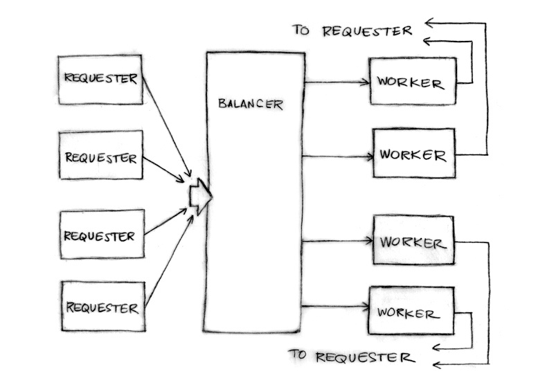

# 负载均衡



请求者向均衡服务发送请求

```golang
type Request struct {
    fn func() int  // The operation to perform.
    c  chan int    // The channel to return the result.
}
```

> 注意这返回的通道是放在请求内部的。通道是 first-class 值

能很好的模拟一个请求者，一个负载产生者

```golang
func requester(work chan<- Request) {
    c := make(chan int)
    for {
        // Kill some time (fake load).
        Sleep(rand.Int63n(nWorker * 2 * Second))
        work <- Request{workFn, c} // send request
        result := <-c              // wait for answer
        furtherProcess(result)
    }
}
```

请求通道，加上一些负载记录数据

```golang
type Worker struct {
    requests chan Request // work to do (buffered channel)
    pending  int          // count of pending tasks
    index     int         // index in the heap
}
```

均衡服务将请求发送给压力最小的 worker

```golang
func (w *Worker) work(done chan *Worker) {
    for {
        req := <-w.requests // get Request from balancer
        req.c <- req.fn()   // call fn and send result
        done <- w           // we've finished this request
    }
}
```

请求通道(w.requests)将请求提交给各个 worker。均衡服务跟踪请求待处理的数量来判断负载情况。

每个响应直接反馈给它的请求者。

- 定义负载均衡器

```golang
// 负载均衡器需要一个装很多worker的池子和一个通道来让请求者报告任务完成情况。
type Pool []*Worker
type Balancer struct {
    pool Pool
    done chan *Worker
}
```

- 负载均衡函数

```golang
func (b *Balancer) balance(work chan Request) {
    for {
        select {
        case req := <-work: // received a Request...
            b.dispatch(req) // ...so send it to a Worker
        case w := <-b.done: // a worker has finished ...
            b.completed(w)  // ...so update its info
        }
    }
}
```

- 将负载均衡的池子用一个 Heap 接口实现

```golang
// 使用堆来跟踪负载情况
func (p Pool) Less(i, j int) bool {
    return p[i].pending < p[j].pending
}
```

- Dispatch

```golang
// Send Request to worker
func (b *Balancer) dispatch(req Request) {
    // Grab the least loaded worker...
    w := heap.Pop(&b.pool).(*Worker)
    // ...send it the task.
    w.requests <- req
    // One more in its work queue.
    w.pending++
    // Put it into its place on the heap.
    heap.Push(&b.pool, w)
}
```

- Completed

```golang
// Job is complete; update heap
func (b *Balancer) completed(w *Worker) {
    // One fewer in the queue.
    w.pending--
    // Remove it from heap.
    heap.Remove(&b.pool, w.index)
    // Put it into its place on the heap.
    heap.Push(&b.pool, w)
}
```

> 一个复杂的问题可以被拆分成容易理解的组件。它们可以被并发的处理。结果就是容易理解，高效，可扩展，好用。或许更加并行。
