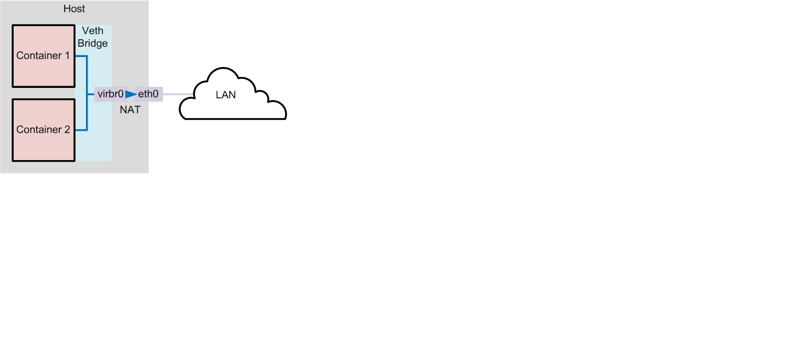

# Docker

## Docker 简介

Docker 两个主要部件：

- Docker: 开源的容器虚拟化平台
- Docker Hub: 用于分享、管理 Docker 容器的 Docker SaaS 平台[Docker Hub](https://hub.docker.com)

Docker 使用客户端-服务器 (C/S) 架构模式。Docker 客户端会与 Docker 守护进程进行通信。Docker 守护进程会处理复杂繁重的任务，例如建立、运行、发布你的 Docker 容器。Docker 客户端和守护进程可以运行在同一个系统上，当然你也可以使用 Docker 客户端去连接一个远程的 Docker 守护进程。

Docker 客户端和守护进程之间通过 socket 或者 RESTful API 进行通信。


### 守护进程

Docker 守护进程运行在一台主机上。用户并不直接和守护进程进行交互，而是通过 Docker 客户端间接和其通信。

### 客户端

Docker 客户端，实际上是 docker 的二进制程序，是主要的用户与 Docker 交互方式。它接收用户指令并且与背后的 Docker 守护进程通信，如此来回往
复。

### 要理解 Docker 内部构建，需要理解以下三种部件：

- Docker 镜像 - Docker images
  Docker 镜像是 Docker 容器运行时的只读模板，每一个镜像由一系列的层(layers) 组成。Docker 使用 UnionFS 来将这些层联合到单独的镜像中。

  UnionFS 允许独立文件系统中的文件和文件夹(称之为分支)被透明覆盖，形成一个单独连贯的文件系统。正因为有了这些层的存在，Docker 是如此的轻量。

  当你改变了一个 Docker 镜像，比如升级到某个程序到新的版本，一个新的层会被创建。因此，不用替换整个原先的镜像或者重新建立(在使用虚拟机的时候你可能会这么做)，只是一个新 的层被添加或升级了。现在你不用重新发布整个镜像，只需要升级，层使得分发 Docker 镜像变得简单和快速。

- Docker 仓库 - Docker registeries
  Docker 仓库用来保存镜像，可以理解为代码控制中的代码仓库。同样的，Docker 仓库也有公有和私有的概念。公有的 Docker 仓库名字是 Docker Hub。Docker Hub 提供了庞大的镜像集合供使用。这些镜像可以是自己创建，或者在别人的镜像基础上创建。Docker 仓库是 Docker 的分发部分。
- Docker 容器 - Docker containers
  Docker 容器和文件夹很类似，一个 Docker 容器包含了所有的某个应用运行所需要的环境。每一个 Docker 容器都是从 Docker 镜像创建的。Docker 容器可以运行、开始、停止、移动和删除。每一个 Docker 容器都是独立和安全的应用平台，Docker 容器是 Docker 的运行部分。

### libcontainer

Docker 从 0.9 版本开始使用 libcontainer 替代 lxc，libcontainer 和 Linux 系统的交互图如下：


### 命名空间「Namespaces」

#### pid

#### mnt

#### net

#### urs

#### ipc

#### user

### 资源配额「cgroups」

cgroups 实现了对资源的配额和度量。 cgroups 的使用非常简单，提供类似文件的接口，在 /cgroup 目录下新建一个文件夹即可新建一个 group，在此文件夹中新建 task 文件，并将 pid 写入该文件，即可实现对该进程的资源控制。具体的资源配置选项可以在该文件夹中新建子 subsystem ，{子系统前缀}.{资源项} 是典型的配置方法， 如 memory.usageinbytes 就定义了该 group 在 subsystem memory 中的一个内存限制选项。 另外，cgroups 中的 subsystem 可以随意组合，一个 subsystem 可以在不同的 group 中，也可以一个 group 包含多个 subsystem - 也就是说一个 subsystem。

- 内存相关的限制(memory)
- 在 cgroup 中，并不能像硬件虚拟化方案一样能够定义 CPU 能力，但是能够定义 CPU 轮转的优先级，因此具有较高 CPU 优先级的进程会更可能得到 CPU 运算。 通过将参数写入 cpu.shares ,即可定义改 cgroup 的 CPU 优先级 - 这里是一个相对权重，而非绝对值
- block IO 相关的统计和限制，byte/operation 统计和限制 (IOPS 等)，读写速度限制等，但是这里主要统计的都是同步 IO
- 设备权限限制(devices)

## Docker 使用

### Docker 安装

### Docker 常用命令

#### 查看 docker 信息（version、info）

- 查看 docker 版本
  `$docker version`
- 显示 docker 系统的信息
  `$docker info`
- 帮助命令

```sh
$ sudo docker # docker 命令帮助
Usage of docker:
--api-enable-cors=false              # 远程 API 中开启 CORS 头
-b, --bridge=""                      # 桥接网络
--bip=""                             # 和 -b 选项不兼容，具体没有测试过
-d, --daemon=false                   # daemon 模式
-D, --debug=false                    # debug 模式
--dns=[]                             # 强制 docker 使用指定 dns 服务器
--dns-search=[]                      # 强制 docker 使用指定 dns 搜索域
-e, --exec-driver="native"           # 强制 docker 运行时使用指定执行驱动器
--fixed-cidr=""
-G, --group="docker"                 # Group to assign the unix socket specified by -H when running in daemon mode
use '' (the empty string) to disable setting of a group
-g, --graph="/var/lib/docker"        # 容器运行的根目录路径
-H, --host=[]                        # daemon 模式下 docker 指定绑定方式[tcp or 本地 socket]
--icc=true                           # 跨容器通信
--insecure-registry=[]
--ip="0.0.0.0"                       # 指定监听地址，默认所有 ip
--ip-forward=true                    # 开启转发
--ip-masq=true                       # Enable IP masquerading for bridge's IP range
--iptables=true                      # 添加对应 iptables 规则
--mtu=0                              # 设置网络 mtu
-p, --pidfile="/var/run/docker.pid"  # 指定 pid 文件位置
--registry-mirror=[]                 # 指定一个首选的Docker注册镜像。
-s, --storage-driver=""              # 强制 docker 运行时使用指定存储驱动
--selinux-enabled=false              # 开启 selinux 支持
--storage-opt=[]                     # 设置存储驱动选项
--tls=false                          # 开启 tls
--tlscacert="/root/.docker/ca.pem"   # 信任只提供由CA在此签署的证书。
--tlscert="/root/.docker/cert.pem"   # tls 证书文件位置
--tlskey="/root/.docker/key.pem"     # tls key 文件位置
--tlsverify=false                    # 使用 tls 并确认远程控制主机
-v, --version=false                  # 输出 docker 版本信息
Commands:
attach  # 当前 shell 下 attach 连接指定运行镜像
build   # 通过 Dockerfile 定制镜像
commit  # 提交当前容器为新的镜像
cp      # 从容器中拷贝指定文件或者目录到宿主机中
create  # 创建一个新的容器，同 run，但不启动容器
diff    # 查看 docker 容器变化
events  # 从 docker 服务获取容器实时事件
exec    # 在已存在的容器上运行命令
export  # 导出容器的内容流作为一个 tar 归档文件[对应 import ]
history # 展示一个镜像形成历史
images  # 列出系统当前镜像
import  # 从 tar包中的内容创建一个新的文件系统映像[对应 export]
info    # 显示系统相关信息
inspect # 查看容器详细信息
kill    # kill 指定 docker 容器
load    # 从一个 tar 包中加载一个镜像[对应 save]
login   # 注册或者登陆一个 docker 源服务器
logout  # 从当前 Docker registry 退出
logs    # 输出当前容器日志信息
port    # 查看映射端口对应的容器内部源端口
pause   # 暂停容器
ps      # 列出容器列表
pull    # 从 docker镜像源服务器拉取指定镜像或者库镜像
push    # 推送指定镜像或者库镜像至 docker源服务器
restart # 重启运行的容器
rm      # 移除一个或者多个容器
rmi     # 移除一个或多个镜像[无容器使用该镜像才可删除，否则需删除相关容器才可继续或 -f 强制删除]
run     # 创建一个新的容器并运行一个命令
save    # 保存一个镜像为一个 tar 包[对应 load]
search  # 在 docker hub 中搜索镜像
start   # 启动容器
stop    # 停止容器
tag     # 给源中镜像打标签
top     # 查看容器中运行的进程信息
unpause # 取消暂停容器
version # 查看 docker 版本号
wait    # 截取容器停止时的退出状态值

Run 'docker COMMAND --help' for more information on a command.
```

#### 对 image 的操作（search、pull、images、rmi、history）

- 检索 image
  `$docker search image_name`
- 下载 image
  `$docker pull image_name`
- 列出镜像列表; -a, --all=false 显示所有镜像; --no-trunc=false 不要截断输出; -q, --quiet=false 仅显示数字 ID
  `$docker images`
- 删除一个或者多个镜像; -f, --force=false 强行; --no-prune=false 不要删除未标记的父级
  `$docker rmi image_name`
- 显示一个镜像的历史; --no-trunc=false 不要截断输出; -q, --quiet=false 仅显示数字 ID
  `$docker history image_name`

#### 启动容器（run）

docker 容器可以理解为在沙盒中运行的进程。这个沙盒包含了该进程运行所必须的资源，包括文件系统、系统类库、shell 环境等等。但这个沙盒默认是不会运行任何程序的。你需要在沙盒中运行一个进程来启动某一个容器。这个进程是该容器的唯一进程，所以当该进程结束的时候，容器也会完全的停止。

- 在容器中运行"echo"命令，输出"hello word"
  `$docker run image_name echo "hello word"`
- 交互式进入容器中
  `$docker run -i -t image_name /bin/bash`
- 挂载本地目录,实现文件共享
  `$docker run -it -v _path:docker_path image_name /bin/bash`
- 在容器中安装新的程序
  `$docker run image_name apt-get install -y app_name`
- 退出交互 **_Ctrl-Dorexit_**
- 暂时离开 **_Ctrl-P + Ctrl-Q_**
- 重新回来 `$docker attach docker_id`

_注意：   在执行 apt-get 命令的时候，要带上-y 参数。如果不指定-y 参数的话，apt-get 命令会进入交互模式，需要用户输入命令来进行确认，但在 docker 环境中是无法响应这种交互的。apt-get 命令执行完毕之后，容器就会停止，但对容器的改动不会丢失。_

#### 查看容器（ps）

- 列出当前所有正在运行的 container
  `$docker ps`
- 列出所有的 container\$docker ps -a
- 列出最近一次启动的 container
  `$docker ps -l`

#### 保存对容器的修改（commit）

当你对某一个容器做了修改之后（通过在容器中运行某一个命令），可以把对容器的修改保存下来，这样下次可以从保存后的最新状态运行该容器。

- 保存对容器的修改; -a, --author="" 作者; -m, --message="" 提交消息
  `$docker commit ID new_image_name`

_注意：  image 相当于类，container 相当于实例，不过可以动态给实例安装新软件，然后把这个 container 用 commit 命令固化成一个 image。_

#### 对容器的操作（rm、stop、start、kill、logs、diff、top、cp、restart、attach）

- 删除所有容器

```bash
$docker rm `docker ps -a -q`
```

- 删除单个容器; -f, --force=false; -l, --link=false 删除指定的链接，而不是基础容器; -v, --volumes=false 删除与容器关联的卷
  `$docker rm Name/ID`
- 停止、启动、杀死一个容器
  `$docker stop Name/ID`
  `$docker start Name/ID`
  `$docker kill Name/ID`
- 从一个容器中取日志; -f, --follow=false 按照日志输出; -t, --timestamps=false 显示时间戳
  `$docker logs Name/ID`
- 列出一个容器里面被改变的文件或者目录，list 列表会显示出三种事件，A 增加的，D 删除的，C 被改变的
  `$docker diff Name/ID`
- 显示一个运行的容器里面的进程信息
  `$docker top Name/ID`
- 从容器里面拷贝文件/目录到本地一个路径
  `$docker cp Name:/container_path to_path`
  `$docker cp ID:/container_path to_path`
- 重启一个正在运行的容器; -t, --time=10 尝试在停止容器之前停止的秒数, 默认=10
  `$docker restart Name/ID`
- 附加到一个运行的容器上面; --no-stdin=false 不要附加标准输入(stdin); --sig-proxy=true 将所有接收到的信号代理给进程
  `$docker attach ID`

_注意： attach 命令允许你查看或者影响一个运行的容器。你可以在同一时间 attach 同一个容器。你也可以从一个容器中脱离出来，是从 CTRL-C。_

#### 保存和加载镜像（save、load）

当需要把一台机器上的镜像迁移到另一台机器的时候，需要保存镜像与加载镜像。

- 保存镜像到一个 tar 包; -o, --output="" 写入文件
  `$docker save image_name -o file_path`
- 加载一个 tar 包格式的镜像; -i, --input="" 从 tar 存档文件读取
  `$docker load -i file_path`
- 机器 a
  `$docker save image_name > /home/save.tar`
- 使用 scp 将 save.tar 拷到机器 b 上，然后：
  `$docker load < /home/save.tar`

#### 登录 registry server（login）

- 登陆 registry server; -e, --email="" 电子邮件; -p, --password="" 密码; -u, --username="" 用户名
  `$docker login`

#### 发布 image（push）

- 发布 docker 镜像
  `$docker push {私有源}/new_image_name`

#### 根据 Dockerfile 构建出一个容器

- build
  --no-cache=false 在构建映像时不要使用缓存
  -q, --quiet=false 抑制由容器生成的详细输出
  --rm=true 成功构建后删除中间容器
  -t, --tag="" 在成功的情况下应用于生成的图像的存储库名称（以及可选的标记）
  `$docker build -t image_name Dockerfile_path`

### Docker 常用操作

#### 端口映射

```bash
$sudo docker run -t -P --expose 22 --name server ubuntu:14.04
$sudo docker run -p 127.0.0.1::8080 <image> <cmd>       # 绑定 TCP 端口
$sudo docker run -p 127.0.0.1:53:5353/udp <image> <cmd> # 绑定 UDP 端口
```

#### 网络配置


Dokcer 通过使用 Linux 桥接提供容器之间的通信，docker0 桥接接口的目的就是方便 Docker 管理。当 Docker daemon 启动时需要做以下操作：

- 如果 docker0 不存在则创建
- 搜索一个与当前路由不冲突的 ip 段
- 在确定的范围中选择 ip
- 绑定 ip 到 docker0

docker run 创建 Docker 容器时，可以用 --net 选项指定容器的网络模式，Docker 有以下 4 种网络模式：

- host 模式，使用 --net=host 指定。
  如果启动容器的时候使用 host 模式，那么这个容器将不会获得一个独立的 Network Namespace，而是和宿主机共用一个 Network Namespace。容器将不会虚拟出自己的网卡，配置自己的 IP 等，而是使用宿主机的 IP 和端口。
- container 模式，使用 --net=container:NAMEorID 指定。
  这个模式指定新创建的容器和已经存在的一个容器共享一个 Network Namespace，而不是和宿主机共享。新创建的容器不会创建自己的网卡，配置自己的 IP，而是和一个指定的容器共享 IP、端口范围等。同样，两个容器除了网络方面，其他的如文件系统、进程列表等还是隔离的。两个容器的进程可以通过 lo 网卡设备通信。
- none 模式，使用 --net=none 指定。
  这个模式和前两个不同。在这种模式下，Docker 容器拥有自己的 Network Namespace，但是，并不为 Docker 容器进行任何网络配置。也就是说，这个 Docker 容器没有网卡、IP、路由等信息。需要我们自己为 Docker 容器添加网卡、配置 IP 等。
- bridge 模式，使用 --net=bridge 指定，默认设置。

  

  bridge 模式是 Docker 默认的网络设置，此模式会为每一个容器分配 Network Namespace、设置 IP 等，并将一个主机上的 Docker 容器连接到一个虚拟网桥上。当 Docker server 启动时，会在主机上创建一个名为 docker0 的虚拟网桥，此主机上启动的 Docker 容器会连接到这个虚拟网桥上。虚拟网桥的工作方式和物理交换机类似，这样主机上的所有容器就通过交换机连在了一个二层网络中。接下来就要为容器分配 IP 了，Docker 会从 RFC1918 所定义的私有 IP 网段中，选择一个和宿主机不同的 IP 地址和子网分配给 docker0，连接到 docker0 的容器就从这个子网中选择一个未占用的 IP 使用。

## Dockerfile

Docker 可以通过 Dockerfile 的内容来自动构建镜像。Dockerfile 是一个包含创建镜像所有命令的文本文件，通过 docker build 命令可以根据 Dockerfile 的内容构建镜像，在介绍如何构建之前先介绍下 Dockerfile 的基本语法结构。

Dockerfile 有以下指令选项:

- FROM

  ```Dockerfile
  FROM <image>
  ```

  指定构建镜像的基础源镜像

  必须是 Dockerfile 中非注释行的第一个指令，即一个 Dockerfile 从 FROM 语句开始。

  FROM 可以在一个 Dockerfile 中出现多次，如果有需求在一个 Dockerfile 中创建多个镜像。

  如果 FROM 语句没有指定镜像标签，则默认使用 latest 标签。

- MAINTAINER

  ```Dockerfile
  MAINTAINER <name>
  ```

  指定创建镜像的用户

- RUN

  ```Dockerfile
  RUN
  RUN "executable", "param1", "param2"
  ```

  每条 RUN 指令将在当前镜像基础上执行指定命令，并提交为新的镜像，后续的 RUN 都在之前 RUN 提交后的镜像为基础，镜像是分层的，可以通过一个镜像的任何一个历史提交点来创建，类似源码的版本控制。

- CMD

  ```Dockerfile
  CMD "executable","param1","param2"
  CMD "param1","param2"
  CMD command param1 param2 (shell form)
  ```

  在 Dockerfile 中只能使用一次，如果有多个，则只有最后一个会生效。

  CMD 会在启动容器的时候执行，build 时不执行，而 RUN 只是在构建镜像的时候执行，后续镜像构建完成之后，启动容器就与 RUN 无关了，这个初学者容易弄混这个概念，这里简单注解一下。

- EXPOSE

  ```Dockerfile
  EXPOSE <port> [<port>...]
  ```

  告诉 Docker 服务端容器对外映射的本地端口，需要在 docker run 的时候使用-p 或者-P 选项生效。

- ENV

  ```Dockerfile
  ENV <key> <value>     # 只能设置一个变量
  ENV <key>=<value> ... # 允许一次设置多个变量
  ```

  指定一个环节变量，会被后续 RUN 指令使用，并在容器运行时保留。

- ADD

  ```Dockerfile
  ADD <src>... <dest>
  ```

  复制本地主机文件、目录或者远程文件 URLS 从 并且添加到容器指定路径中 。

- COPY

  ```Dockerfile
  COPY <src>... <dest>
  ```

  COPY 复制新文件或者目录从 并且添加到容器指定路径中 。用法同 ADD，唯一的不同是不能指定远程文件 URLS。

- ENTRYPOINT

  ```Dockerfile
  ENTRYPOINT "executable", "param1", "param2"
  ENTRYPOINT command param1 param2 (shell form)
  ```

  每个 Dockerfile 中只能有一个 ENTRYPOINT，当指定多个时，只有最后一个生效。

- VOLUME

  ```Dockerfile
  VOLUME ["/data"]
  ```

- USER

  ```Dockerfile
  USER daemon
  ```

  指定运行容器时的用户名或 UID，后续的 RUN、CMD、ENTRYPOINT 也会使用指定用户。

- WORKDIR

  ```Dockerfile
  WORKDIR /path/to/workdir
  ```

  为后续的 RUN、CMD、ENTRYPOINT 指令配置工作目录。可以使用多个 WORKDIR 指令，后续命令如果参数是相对路径，则会基于之前命令指定的路径。

- ONBUILD

  ```Dockerfile
  ONBUILD [INSTRUCTION]
  ```

  配置当所创建的镜像作为其它新创建镜像的基础镜像时，所执行的操作指令。

> Examples

```Dockerfile
# Nginx
#
# VERSION 0.0.1
FROM ubuntu
MAINTAINER Victor Vieux <victor@docker.com>
RUN apt-get update && apt-get install -y inotify-tools nginx apache2
openssh-server
# Firefox over VNC
#
# VERSION 0.3
FROM ubuntu
# Install vnc, xvfb in order to create a 'fake' display and firefox
RUN apt-get update && apt-get install -y x11vnc xvfb firefox
RUN mkdir ~/.vnc
# Setup a password
RUN x11vnc -storepasswd 1234 ~/.vnc/passwd
# Autostart firefox (might not be the best way, but it does the trick)
RUN bash -c 'echo "firefox" >> /.bashrc'
EXPOSE 5900
CMD ["x11vnc", "-forever", "-usepw", "-create"]
# Multiple images example
#
# VERSION 0.1
FROM ubuntu
RUN echo foo > bar
# Will output something like ===> 907ad6c2736f
FROM ubuntu
RUN echo moo > oink
# Will output something like ===> 695d7793cbe4
# You ll now have two images, 907ad6c2736f with /bar, and 695d7793cbe4 with ᾿
# /oink.
```

### build

```bash
docker build
```

- .dockerignore
  排除构建镜像时不需要的文件或目录
- 避免安装不必要的软件包
  为了降低复杂性、依赖性、文件大小以及构建时间，应该避免安装额外的或不必要的包。例如，不需要在一个数据库镜像中安装一个文本编辑器。
- 每个容器都跑一个进程
- 最小化层
  减少 RUN 命令
- 多行参数排序
- 创建缓存
  镜像构建过程中会按照 Dockerfile 的顺序依次执行，每执行一次指令 Docker 会寻找是否有存在的镜像缓存可复用，如果没有则创建新的镜像。如果不想使用缓存，则可以在 docker build 时添加--no-cache=true 选项。

## Registry


## Docker 源码分析

- init 函数的执行。在 Golang 中 init 函数的特性如下：
  - init 函数用于程序执行前包的初始化工作，比如初始化变量等；
  - 每个包可以有多个 init 函数；
  - 包的每一个源文件也可以有多个 init 函数；
  - 同一个包内的 init 函数的执行顺序没有明确的定义；
  - 不同包的 init 函数按照包导入的依赖关系决定初始化的顺序；
  - init 函数不能被调用，而是在 main 函数调用前自动被调用。
- os.Setenv("DEBUG", "1") 创建系统环境变量
- Docker 源码分析 孙宏亮 -infoQ
  - [Docker 源码分析（一）：Docker 架构](http://www.infoq.com/cn/articles/docker-source-code-analysis-part1)
  - [Docker 源码分析（二）：Docker Client 创建与命令执行](http://www.infoq.com/cn/articles/docker-source-code-analysis-part2)
  - [Docker 源码分析（三）：Docker Daemon 启动](http://www.infoq.com/cn/articles/docker-source-code-analysis-part3)
  - [Docker 源码分析（四）：Docker Daemon 之 NewDaemon 实现](http://www.infoq.com/cn/articles/docker-source-code-analysis-part4)
  - [Docker 源码分析（五）：Docker Server 的创建](http://www.infoq.com/cn/articles/docker-source-code-analysis-part5)
  - [Docker 源码分析（六）：Docker Daemon 网络](http://www.infoq.com/cn/articles/docker-source-code-analysis-part6)
  - [Docker 源码分析（七）：Docker Container 网络 （上）](http://www.infoq.com/cn/articles/docker-source-code-analysis-part7)
  - [Docker 源码分析（八）：Docker Container 网络 （下）](http://www.infoq.com/cn/articles/docker-source-code-analysis-part8)
  - [Docker 源码分析（九）：Docker 镜像](http://www.infoq.com/cn/articles/docker-source-code-analysis-part9)
  - [Docker 源码分析（十）：Docker 镜像下载](http://www.infoq.com/cn/articles/docker-source-code-analysis-part10)
  - [Docker 源码分析（十一）：镜像存储](http://www.infoq.com/cn/articles/docker-source-code-analysis-part11)
  - [Docker 三年回顾：梦想依在，人生正当年](http://www.infoq.com/cn/articles/docker-turns-3)
  - [超大规模容器调度系统的设计与实现](http://www.infoq.com/cn/presentations/how-to-design-an-ultra-large-scale-container-scheduling-system)

## API

### Registry API

Docker Registry API 是 Docker Registry 的 REST API，它简化了镜像和仓库的存储。该 API 不能访问用户帐户或者获得授权。

### Hub API

### OAuth API

### Remote API

### Images API

## 图书

- [Docker 技术入门与实战](https://legacy.gitbook.com/book/yeasy/docker_practice/details)

---

> 官网：

- [Github](https://github.com/docker/docker)
- [Docker](https://www.docker.com/)
- [Dockerhub](https://hub.docker.com/)
