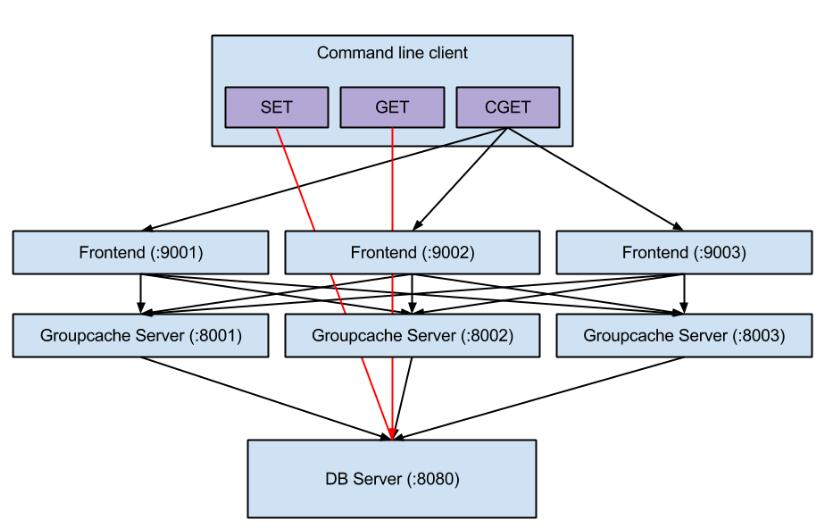

# GroupCache

> [GroupCache](https://github.com/golang/groupcache)是[Brad Fitzpatrick](http://bradfitz.com/)  最新的作品，目标在于取代一部分 memcached 的功能。以官方的说明是：groupcache is a caching and cache-filling library, intended as a replacement for memcached in many cases.
> 另外一篇介绍文是「[Playing With Groupcache](http://www.capotej.com/blog/2013/07/28/playing-with-groupcache/)」。跟 memcached 差异最大的地方在于「没有更改与删除的功能」，一旦写进去后就不会变动。在放弃 update/delete 的特性后，换来的是：

- Cluster 的能力。
- 处理热点的能力。

以往在 memcached server 之间是没有交集的，在 groupcache 则是 cluster 起来。另外以前在 memcached 会因为同时存取同一个 key 而造成 single CPU overloading 的问题，在 groupcache 则透过 auto-mirror 机制解决。参考：[Go 语言编写的缓存及缓存过滤库：groupcache](http://blog.csdn.net/songbohr/article/details/16349989) 。其中 groupcache 与 memcached 最大的区别是不需要启动额外的服务。groupcache 作为 lib 库缓存数据，不需要单独开启服务器，减少了服务器额外维护的代价。groupcache 也常被推荐为适合 Golang 初学者分析的代码段，这几天我也抽空分析了一下具体的实现，并结合 Play With Groupcach 简单的测试了 GroupCache，实现的基本结构如下所示：

该软件结构图实现了一种只读型静态网站的分布式实现。主要包括三个服务器，其中 DB Server 是数据库，主要对外提供数据，在实际的场景中可以是 NoSql 数据库也可能是关系数据库。可对该数据库进行插入、新增数据。缓存服务器，分为前端和 GroupCache Server，实际上将 Cache Server 包含在了业务代码中，其中前端是提供操作的相关接口，而后端部分通常作为业务服务器的一部分，缓存数据可直接被服务器使用。Cli 部分主要是用于操作数据量和 groupcache server 交互。这部分代码可参考[groupcache-db-experiment ](https://github.com/capotej/groupcache-db-experiment) 。

- 基本过程如下所示:
  - 首先创建一个 GroupCache 的 HTTPool, peers。
  - 创建 Group 对象， 设置该 Group Cache 的大小，数据实际获取的方法，其中的  groupcache.GetterFunc 对应着实际从源头加载数据的方法，比如从数据库中获取、从文件中获取等。这也是必须的。groupcache.GetterFunc 实际上是 groupcache.Getter 的接口实例。
  - 设置对端 GroupCache 的地址信息。peers.Set(url1, url2, ...)
  - 启动 GroupCache 的 Http 服务。在 http.ListenAndServe("xxxx", http.HandlerFunc(peers.ServeHTTP))
  - 要获取数据只需要通过创建的 Group 对象来获取即可。group.Get(xxx)。
