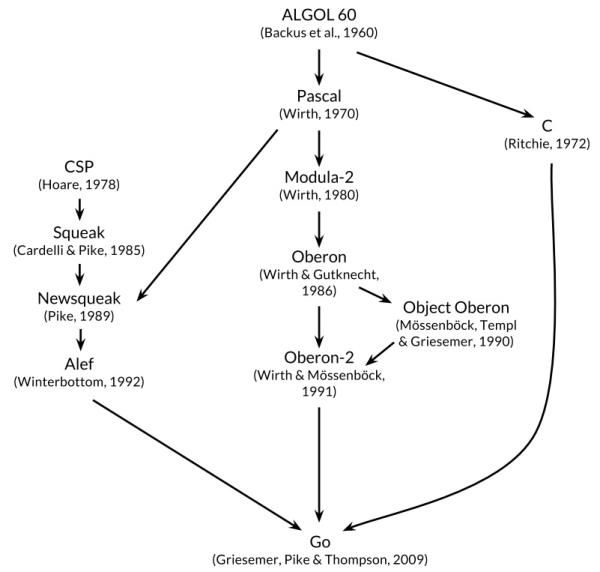
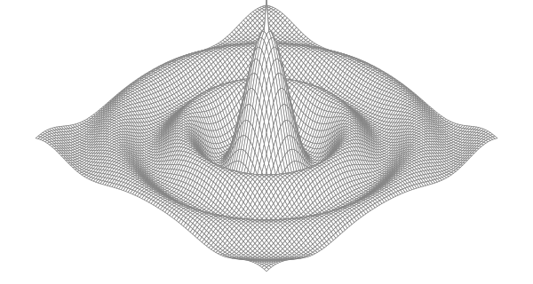
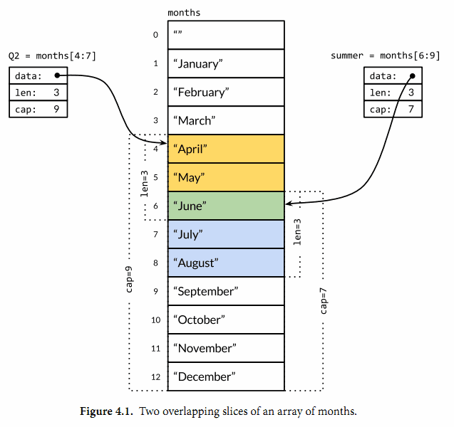
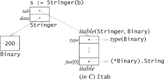

# Go 语言圣经

## 前言

### Go 语言起源



### Go 语言项目

- "软件的复杂性是乘法级相关的-----[Rob Pike](http://genius.cat-v.org/rob-pike/)"
- 简洁的设计需要在工作开始的时候舍弃不必要的想法，并且在软件的生命周期内严格区别好的改变和坏的改变。通过足够的努力，一个好的改变可以在不破坏原有完整概念的前提下保持自适应，正如[Fred Brooks](http://www.cs.unc.edu/~brooks/)所说的“概念完整性”；而一个坏的改变则不能达到这个效果，它们仅仅是通过肤浅的和简单的妥协来破坏原有设计的一致性。只有通过简洁的设计，才能让一个系统保持稳定、安全和持续的进化。

### 本书的组织

**_基础_**

- 第一章包含了本教程的基本结构，通过十几个程序介绍了用 Go 语言如何实现类似读写文件、文本格式化、创建图像、网络客户端和服务器通讯等日常工作。
- 第二章描述了 Go 语言程序的基本元素结构、变量、新类型定义、包和文件、以及作用域等概念。
- 第三章讨论了数字、布尔值、字符串和常量，并演示了如何显示和处理 Unicode 字符。
- 第四章描述了复合类型，从简单的数组、字典、切片到动态列表。
- 第五章涵盖了函数，并讨论了错误处理、panic 和 recover，还有 defer 语句。

`第一章到第五章是基础部分，主流命令式编程语言这部分都类似。个别之处，Go语言有自己特色的语法和风格，但是大多数程序员能很快适应。其余章节是Go语言特有的：方法、接口、并发、包、测试和反射等语言特性。`

**_进阶_**

- 第八章讨论了基于顺序通信进程(CSP)概念的并发编程，使用 goroutines 和 channels 处理并发编程。
- 第九章则讨论了传统的基于共享变量的并发编程。
- 第十章描述了包机制和包的组织结构。这一章还展示了如何有效地利用 Go 自带的工具，使用单个命令完成编译、测试、基准测试、代码格式化、文档以及其他诸多任务。
- 第十一章讨论了单元测试，Go 语言的工具和标准库中集成了轻量级的测试功能，避免了强大但复杂的测试框架。测试库提供了一些基本构件，必要时可以用来构建复杂的测试构件。
- 第十二章讨论了反射，一种程序在运行期间审视自己的能力。反射是一个强大的编程工具，不过要谨慎地使用；这一章利用反射机制实现一些重要的 Go 语言库函数, 展示了反射的强大用法。第十三章解释了底层编程的细节，在必要时，可以使用 unsafe 包绕过 Go 语言安全的类型系统。

---

## 第一章：入门

### Hello, World

**_`尝试用100中方法打印出Hello, World`_**
哈哈!

```go
package main

func main() {
  print("Hello, 世界") //Go语言原生支持Unicode，它可以处理全世界任何语言的文本。
}
```

### 命令行参数

os 包以跨平台的方式，提供了一些与操作系统交互的函数和变量。程序的命令行参数可从 os 包的 Args 变量获取；os 包外部使用 os.Args 访问该变量。

### 查找重复的行

- `bufio`包，它使处理输入和输出方便又高效。Scanner 类型是该包最有用的特性之一，它读取输入并将其拆成行或单词；通常是处理行形式的输入最简单的方法。
- 格式化*verb*

```
%d          十进制整数
%x, %o, %b  十六进制，八进制，二进制整数。
%f, %g, %e  浮点数： 3.141593 3.141592653589793 3.141593e+00
%t          布尔：true或false
%c          字符（rune） (Unicode码点)
%s          字符串
%q          带双引号的字符串"abc"或带单引号的字符'c'
%v          变量的自然形式（natural format）
%T          变量的类型
%%          字面上的百分号标志（无操作数）
```

`ioutil.ReadFile(filename)`函数返回一个字节切片（byte slice）

### GIF 动画

- 生成的图形名字叫利萨如图形(Lissajous figures)

### 获取 URL

http.Get(url)
ioutil.ReadAll(resp.Body)

### 并发获取多个 URL

goroutine 和 channel

### Web 服务

```go
package main

import (
  "fmt"
  "log"
  "net/http"
)

func main() {
  http.HandleFunc("/", handler) // each request calls handler
  log.Fatal(http.ListenAndServe("localhost:8000", nil))
}

// handler echoes the Path component of the requested URL.
func handler(w http.ResponseWriter, r *http.Request) {
  fmt.Fprintf(w, "URL.Path = %q\n", r.URL.Path)
}
```

- 如果你的请求 pattern 是以/结尾，那么所有以该 url 为前缀的 url 都会被这条规则匹配。

### 要点

- **控制流**

```go
  switch coinflip() {
  case "heads":
    heads++
  case "tails":
    tails++
  default:
    fmt.Println("landed on edge!")
```

Go 语言并不需要显式地在每一个 case 后写 break
如果你想要相邻的几个 case 都执行同一逻辑的话，需要自己显式地写上一个 fallthrough 语句来覆盖这种默认行为。

- **命名类型**
- **指针**
  指针是一种直接存储了变量的内存地址的数据类型。指针是可见的内存地址，&操作符可以返回一个变量的内存地址，并且\*操作符可以获取指针指向的变量内容，但是在 Go 语言里没有指针运算，也就是不能像 c 语言里可以对指针进行加或减操作。
- **方法和接口**
  Go 语言里的方法可以被关联到任意一种命名类型。
- **包**
- **注释**

---

## 第二章：程序结构

### 命名

- 25 个关键字
  `break default func interface select case defer go map struct chan else goto package switch const fallthrough if range type continue for import return var`
- 30 多个预定义的名字
  `内建常量: true false iota nil 内建类型: int int8 int16 int32 int64 uint uint8 uint16 uint32 uint64 uintptr float32 float64 complex128 complex64 bool byte rune string error 内建函数: make len cap new append copy close delete complex real imag panic recover`
- Go 语言程序员推荐使用 **驼峰式** 命名

### 声明

### 变量

- 简短变量声明
  `i := 100`
- 指针
  `x := 1 p := &x // p, of type *int, points to x fmt.Println(*p) // "1" *p = 2 // equivalent to x = 2 fmt.Println(x) // "2"`
- new 函数
  `p := new(int) // p, *int 类型, 指向匿名的 int 变量`
- 变量的生命周期
  Go 语言的自动垃圾收集器对编写正确的代码是一个巨大的帮助，但也并不是说你完全不用考虑内存了。你虽然不需要显式地分配和释放内存，但是要编写高效的程序你依然需要了解变量的生命周期。例如，如果将指向短生命周期对象的指针保存到具有长生命周期的对象中，特别是保存到全局变量时，会阻止对短生命周期对象的垃圾回收（从而可能影响程序的性能）。

### 赋值

- 元组赋值
  `x, y = y, x a[i], a[j] = a[j], a[i]`
- 可赋值性
  可赋值性的规则对于不同类型有着不同要求，*对每个新类型特殊的地方我们会专门解释。*对于目前我们已经讨论过的类型，它的规则是简单的：类型必须完全匹配，nil 可以赋值给任何指针或引用类型的变量。常量（§3.6）则有更灵活的赋值规则，因为这样可以避免不必要的显式的类型转换。

### 类型

### 包和文件

- 导入包
  `"fmt" . "fmt" //省略包名 _ "fmt" //只导入`
- 包的初始化
  `func init() { /* ... */ }`

### 作用域

- 不要将作用域和生命周期混为一谈。声明语句的作用域对应的是一个源代码的文本区域；它是一个编译时的属性。一个变量的生命周期是指程序运行时变量存在的有效时间段，在此时间区域内它可以被程序的其他部分引用；是一个运行时的概念。
- 控制流标号，就是 break、continue 或 goto 语句后面跟着的那种标号，则是函数级的作用域。

---

## 第三章：基础数据类型

### 整型

`8、16、32、64bit`

- 运算符

```
*（乘）      /（除）      %（余）      <<（左移）       >>（右移）     &（位运算 AND）       &^（位清空 (AND NOT)）
+（加）      -（减）      | （位运算 OR）     ^（位运算 XOR）
==（等于）     != （不等于）    < （小于）     <=（小于或等于）       > （大于）     >=（大于或等于）
&&（AND）
||（OR）
```

二元运算符有五种优先级。在同一个优先级，使用左优先结合规则，但是使用括号可以明确优先顺序，使用括号也可以用于提升优先级

### 浮点数

`float32和float64`



```go
// Copyright © 2016 Alan A. A. Donovan & Brian W. Kernighan.
// License: https://creativecommons.org/licenses/by-nc-sa/4.0/

// See page 58.
//!+

// Surface computes an SVG rendering of a 3-D surface function.
package main

import (
  "fmt"
  "math"
)

const (
  width, height = 600, 320            // canvas size in pixels
  cells         = 100                 // number of grid cells
  xyrange       = 30.0                // axis ranges (-xyrange..+xyrange)
  xyscale       = width / 2 / xyrange // pixels per x or y unit
  zscale        = height * 0.4        // pixels per z unit
  angle         = math.Pi / 6         // angle of x, y axes (=30°)
)

var sin30, cos30 = math.Sin(angle), math.Cos(angle) // sin(30°), cos(30°)

func main() {
  fmt.Printf("<svg xmlns='http://www.w3.org/2000/svg' "+
    "style='stroke: grey; fill: white; stroke-width: 0.7' "+
    "width='%d' height='%d'>", width, height)
  for i := 0; i < cells; i++ {
    for j := 0; j < cells; j++ {
      ax, ay := corner(i+1, j)
      bx, by := corner(i, j)
      cx, cy := corner(i, j+1)
      dx, dy := corner(i+1, j+1)
      fmt.Printf("<polygon points='%g,%g %g,%g %g,%g %g,%g'/>\n",
        ax, ay, bx, by, cx, cy, dx, dy)
    }
  }
  fmt.Println("</svg>")
}

func corner(i, j int) (float64, float64) {
  // Find point (x,y) at corner of cell (i,j).
  x := xyrange * (float64(i)/cells - 0.5)
  y := xyrange * (float64(j)/cells - 0.5)

  // Compute surface height z.
  z := f(x, y)

  // Project (x,y,z) isometrically onto 2-D SVG canvas (sx,sy).
  sx := width/2 + (x-y)*cos30*xyscale
  sy := height/2 + (x+y)*sin30*xyscale - z*zscale
  return sx, sy
}

func f(x, y float64) float64 {
  r := math.Hypot(x, y) // distance from (0,0)
  return math.Sin(r) / r
}

//!-
```

### 复数

Go 语言提供了两种精度的复数类型：complex64 和 complex128，分别对应 float32 和 float64 两种浮点数精度。内置的 complex 函数用于构建复数，内建的 real 和 imag 函数分别返回复数的实部和虚部：

### 布尔型

### 字符串

```
\a      响铃
\b      退格
\f      换页
\n      换行
\r      回车
\t      制表符
\v      垂直制表符
\'      单引号 (只用在 '\'' 形式的rune符号面值中)
\"      双引号 (只用在 "..." 形式的字符串面值中)
\\      反斜杠
```

- 得益于 UTF8 编码优良的设计，诸多字符串操作都不需要解码操作。我们可以不用解码直接测试一个字符串是否是另一个字符串的前缀：

```go
func HasPrefix(s, prefix string) bool {
      return len(s) >= len(prefix) && s[:len(prefix)] == prefix
}
```

或者是后缀测试：

```go
func HasSuffix(s, suffix string) bool {
      return len(s) >= len(suffix) && s[len(s)-len(suffix):] == suffix
}
```

或者是包含子串测试：

```go
func Contains(s, substr string) bool {
    for i := 0; i < len(s); i++ {
        if HasPrefix(s[i:], substr) {
            return true
        }
    }
    return false
}
```

```go
package main

import "fmt"

func main() {
  s := "Hello, 世界"
  fmt.Printf("%s\t%d\n", s, len(s))
  for i := 0; i < len(s); i++ {
    fmt.Printf("%d\t%v\t%q\n", i, s[i], s[i])
  }
  fmt.Println("...")
  for i, r := range s {
    fmt.Printf("%d\t%d\t%q\n", i, r, r)
  }
}
```

结果

```
Hello, 世界  13
0  72  'H'
1  101  'e'
2  108  'l'
3  108  'l'
4  111  'o'
5  44  ','
6  32  ' '
7  228  'ä'
8  184  '¸'
9  150  '\u0096'
10  231  'ç'
11  149  '\u0095'
12  140  '\u008c'
...
0  72  'H'
1  101  'e'
2  108  'l'
3  108  'l'
4  111  'o'
5  44  ','
6  32  ' '
7  19990  '世'
10  30028  '界'
```

- 字符串和 Byte 切片
  标准库中有四个包对字符串处理尤为重要：bytes、strings、strconv 和 unicode 包。
- strings 包提供了许多如字符串的查询、替换、比较、截断、拆分和合并等功能。
- bytes 包也提供了很多类似功能的函数，但是针对和字符串有着相同结构的[]byte 类型。因为字符串是只读的，因此逐步构建字符串会导致很多分配和复制。在这种情况下，使用 bytes.Buffer 类型将会更有效，稍后我们将展示。
- strconv 包提供了布尔型、整型数、浮点数和对应字符串的相互转换，还提供了双引号转义相关的转换。
- unicode 包提供了 IsDigit、IsLetter、IsUpper 和 IsLower 等类似功能，它们用于给字符分类。每个函数有一个单一的 rune 类型的参数，然后返回一个布尔值。而像 ToUpper 和 ToLower 之类的转换函数将用于 rune 字符的大小写转换。所有的这些函数都是遵循 Unicode 标准定义的字母、数字等分类规范。strings 包也有类似的函数，它们是 ToUpper 和 ToLower，将原始字符串的每个字符都做相应的转换，然后返回新的字符串。
- 字符串和数字的转换

### 常量

- iota 常量生成器

```go
const (
  _   = 1 << (10 * iota)
  KiB // 1024
  MiB // 1048576
  GiB // 1073741824
  TiB // 1099511627776             (exceeds 1 << 32)
  PiB // 1125899906842624
  EiB // 1152921504606846976
  ZiB // 1180591620717411303424    (exceeds 1 << 64)
  YiB // 1208925819614629174706176
)
```

## 第四章：复合数据类型

### 数组

### Slice



- Slice 内存技巧

### Map

在 Go 语言中，一个 map 就是一个哈希表的引用，map 类型可以写为 map[K]V，其中 K 和 V 分别对应 key 和 value。
内置的 make 函数可以创建一个 map：

```go
ages := make(map[string]int) // mapping from strings to ints
```

我们也可以用 map 字面值的语法创建 map，同时还可以指定一些最初的 key/value：

```go
ages := map[string]int{ "alice": 31, "charlie": 34,}
```

使用内置的 delete 函数可以删除元素：

```go
delete(ages, "alice") // remove element ages["alice"]
```

###  结构体

- 结构体比较
  如果结构体的全部成员都是可以比较的，那么结构体也是可以比较的

- 结构体嵌入和匿名成员
- 需要注意的是 Printf 函数中%v 参数包含的#副词，它表示用和 Go 语言类似的语法打印值。对于结构体类型来说，将包含每个成员的名字。
  `fmt.Printf("%#v\n", w)`

### JSON
`json.Marshal`和`json.MarshalIndent`

- json 处理 struct 未导出成员
  golang 的结构体里的成员的名字如果以小写字母开头，那么其他的包是无法访问的，也就是 json 无法访问我们的结构体里小写字母开头的成员。两种解决方法

1. struct 的成员用大写开头，然后加 tag

```go
package main

import (
  "encoding/json"
  "fmt"
  "log"
)

type Movie struct {
  Title  string
  Year   int  `json:"released"`
  Color  bool `json:"color,omitempty"`
  Actors []string
}

func main() {

  var movies = []Movie{
    {Title: "Casablanca", Year: 1942, Color: false,
      Actors: []string{"Humphrey Bogart", "Ingrid Bergman"}},
    {Title: "Cool Hand Luke", Year: 1967, Color: true,
      Actors: []string{"Paul Newman"}},
    {Title: "Bullitt", Year: 1968, Color: true,
      Actors: []string{"Steve McQueen", "Jacqueline Bisset"}},
    // ...
  }

  data, err := json.Marshal(movies) // json.MarshalIndent(struct, "", "    ")
  if err != nil {
    log.Fatalf("JSON marshaling failed: %s", err)
  }
  fmt.Printf("%s\n", data)
}
```

```go
[{"Title":"Casablanca","released":1942,"Actors":["Humphrey Bogart","Ingrid Bergman"]},{"Title":"Cool Hand Luke","released":1967,"color":true,"Actors":["Paul Newman"]},{"Title":"Bullitt","released":1968,"color":true,"Actors":["Steve McQueen","Jacqueline Bisset"]}]
```

2. 实现 json.Marshaler 接口

```go
package main

import (
  "encoding/json"
  "fmt"
)

func main() {
  var s S
  s.a = 5
  s.b[0] = 3.123
  s.b[1] = 111.11
  s.b[2] = 1234.123
  s.c = "hello"
  s.d[0] = 0x55

  j, _ := json.Marshal(s)
  fmt.Println(string(j))
}

type S struct {
  a int
  b [4]float32
  c string
  d [12]byte
}

func (this S) MarshalJSON() ([]byte, error) {
  return json.MarshalIndent(map[string]interface{}{ // json.MarshalIndent(struct, "", "    ")
    "a": this.a,
    "b": this.b,
    "c": this.c,
    "d": this.d,
  }, "", "    ")
}
```

```go
{"a":5,"b":[3.123,111.11,1234.123,0],"c":"hello","d":[85,0,0,0,0,0,0,0,0,0,0,0]}
```

### 文本和 HTML 模板

## 第五章：函数

### 函数声明

### 递归

### 多返回值

### 错误

### 函数值

### 匿名函数

### 可变参数

### Deferred 函数

### Panic 异常

- 一般而言，当 panic 异常发生时，程序会中断运行，并立即执行在该 goroutine（可以先理解成线程，在第 8 章会详细介绍）中被延迟的函数（defer 机制）

### Recover 捕获异常

## 第六章：方法

### 方法声明

### 基于指针对象的方法

### 通过嵌入结构体来扩展类型

### 方法值和方法表达式

### Bit 数组

### 封装

## 第七章：接口

_当设计一个新的包时，新的 Go 程序员总是通过创建一个接口的集合开始和后面定义满足它们的具体类型。这种方式的结果就是有很多的接口，它们中的每一个仅只有一个实现。不要再这么做了。这种接口是不必要的抽象；它们也有一个运行时损耗。你可以使用导出机制(§6.6)来限制一个类型的方法或一个结构体的字段是否在包外可见。接口只有当有两个或两个以上的具体类型必须以相同的方式进行处理时才需要。
当一个接口只被一个单一的具体类型实现时有一个例外，就是由于它的依赖，这个具体类型不能和这个接口存在在一个相同的包中。这种情况下，一个接口是解耦这两个包的一个好好方式。
因为在 Go 语言中只有当两个或更多的类型实现一个接口时才使用接口，它们必定会从任意特定的实现细节中抽象出来。结果就是有更少和更简单方法（经常和 io.Writer 或 fmt.Stringer 一样只有一个）的更小的接口。当新的类型出现时，小的接口更容易满足。对于接口设计的一个好的标准就是 ask only for what you need（只考虑你需要的东西）_

## 第八章：Goroutines 和 Channels

[深入理解 interface](http://blog.csdn.net/justaipanda/article/details/43155949)

Go 语言的主要设计者之一罗布·派克（ Rob Pike）曾经说过，如果只能选择一个 Go 语言的特   性移植到其他语言中，他会选择接口。可见接口在 golang 中的地位，及其对 gloang 这门语言所带来的活力。

> - Q: golang 中的 interface 是什么?

- A: 接口相当于是一份契约，它规定了一个对象所能提供的一组操作。要理解 golang 中接口的概念我们最好还是先来看看别的现代语言是如何实现接口的。

C++没有提供 interface 这样的关键字，它通过纯虚基类实现接口，而 java 则通过 interface 关键字声明接口。它们有个共同特征就是一个类要实现该接口必须进行显示的声明，如下是 java 方式：

```go
interface IFoo {  
  void Bar();  
}  
class Foo implements IFoo {
  void Bar(){}  
}  
```

这种必须明确声明自己实现了   某个接口的方式我们称为侵入式接口。关于侵入式接口的坏处我们这里就不再详细讨论，看 java 庞大的继承体系及其繁复的接口类型我们就可以窥之一二了。
golang 则采取了完全不同的设计理念，在 Go 语言中，一个类只需要实现了接口要求的所有函数，我们就说这个类实现了该接口，  例如：

```go
type IWriter interface {  
  Write(buf [] byte) (n int, err error)  
}  
type File struct {  
  // ...  
}  
func (f *File) Write(buf [] byte) (n int, err error) {  
  // ...  
}  
```

非侵入式接口一个很重要的好处就是去掉了繁杂的继承体系，我们看许大神在《go 语言编程》一书中作的总结：
其一， Go 语言的标准库，再也不需要绘制类库的继承树图。你一定见过不少 C++、 Java、 C#  类库的继承树图。这里给个 Java 继承树图：  http://docs.oracle.com/javase/1.4.2/docs/api/overview-tree.html   在 Go 中，类的继承树并无意义，你只需要知道这个类实现了哪些方法，每个方法是啥含义就足够了。 
其二，实现类的时候，只需要关心自己应该提供哪些方法，不用再纠结接口需要拆得多细才   合理。接口由使用方按需定义，而不用事前规划。 
其三，不用为了实现一个接口而导入一个包，因为多引用一个外部的包，就意味着更多的耦   合。接口由使用方按自身需求来定义，使用方无需关心是否有其他模块定义过类似的接口。
如果仔细研究 golang 中的结构，学 C++的同学可能会发现，golang 中关于接口的概念很似有点像 C++中的 Concept，不知道 concept 的同学可以参看刘未鹏的[《C++0x 漫谈》系列之：Concept, Concept!](http://blog.csdn.net/pongba/article/details/1726031) 。c++用模板来达到这样的效果，不管你使用什么类型来实例化，只要满足该模板所对应的一组操作就可以正常实例化，否则则会编译不通过。不同于 C++的模板在可以完全在编译时检查，golang 在大多数情况下只能在运行时进行接口查询，关于接口查询的详细情况我们稍后再解释。 
另外，如果有同学之前了解过 Qt，则很容易的发现这种非侵入式接口的另一个好处，Qt 里面一个重要的特性就是信号与槽，它实现了监听者与接收者之间的解耦，它所用的方式实际上是 qt 的预处理生成静态的连接代码。而如果使用 golang 来实现这套机制就简直在方便了，不需要预先生成代码的方式，监听者与接收者之间的解耦本身就是 golang 的自然表现。
golang 中的 interface 在面向对象思想中所扮演的角色

golang 不支持完整的面向对象思想，它没有继承，多态则完全依赖接口实现。golang 只能模拟继承，其本质是组合，只不过 golang 语言为我们提供了一些语法糖使其看起来达到了继承的效果。面向对象中一个很重要的基本原则--里氏代换原则(Liskov Substitution Principle LSP)在这里就行不通了，习惯面向对象语言的同学可能会有些不适应，当你将一个父类的指针指向子类的对象时，golang 会毫不吝啬的抛出一个编译错误。
golang 的设计理念是大道至简，传统的继承概念在 golang 中已经显得不是那么必要，golang 通过接口去实现多态，下面我们看一个例子，看看 golang 是如何实现依赖倒置原则的，先看 C++的实现：

```go
struct IPizzaCooker {  
  virtual void Prepare(Pizza*) = 0;  
  virtual void Bake(Pizza*) = 0;  
  virtual void Cut(Pizza*) = 0;  
}  

struct PizzaDefaultCooker : public IPizzaCooker {  
  Pizza* CookOnePizza() {  
    Pizza* p = new Pizza();  
    Prepare(p);  
    Bake(p);  
    Cut(p);  
    return p;  
  }  
  virtual void Prepare(Pizza*) {  
    //....default prepare pizza  
  }  
  virtual void Bake(Pizza*) {  
    //....default bake pizza  
  }  
  virtual void Cut(Pizza*) {  
    //....default cut pizza  
  }  
}  

struct MyPizzaCooker : public PizzaDefaultCooker {  
  virtual void Bake(Pizza*) {  
    //....bake pizza use my style  
  }  
}  

int main() {  
  MyPizzaCooker cooker;  
  Pizza* p = cooker.CookOnePizza();  
  //....  
  return 0;  
}
```

本例子很简单，就是通过一个做 pizza 的类烹饪一个新 pizza，烹饪的流程在父类中实现 CookOnePizza，子类重写了 Bake 方法。下面我们看看 golang 中是如何实现这个例子的：

```go
type IPizzaCooker interface {  
  Prepare(*Pizza)  
  Bake(*Pizza)  
  Cut(*Pizza)  
}  

func cookOnePizza(ipc IPizzaCooker) *Pizza {  
  p := new(Pizza)  
  ipc.Prepare(p)  
  ipc.Bake(p)  
  ipc.Cut(p)  
  return p  
}  

type PizzaDefaultCooker struct {  
}  

func (this *PizzaDefaultCooker) CookOnePizza() *Pizza {  
  return cookOnePizza(this)  
}  
func (this *PizzaDefaultCooker) Prepare(*Pizza) {  
  //....default prepare pizza  
}  
func (this *PizzaDefaultCooker) Bake(*Pizza) {  
  //....default bake pizza  
}  
func (this *PizzaDefaultCooker) Cut(*Pizza) {  
  //....default cut pizza  
}  

type MyPizzaCooker struct {  
  PizzaDefaultCooker  
}  

func (this *MyPizzaCooker) CookOnePizza() *Pizza {  
  return cookOnePizza(this)  
}  
func (this *MyPizzaCooker) Bake(*Pizza) {  
  //....bake pizza use my style  
}  

func main() {  
  var cooker MyPizzaCooker  
  p := cooker.CookOnePizza()  
  //....  
}
```

由于 golang 的多态必须借助接口来实现，这实际上已不是严格意义上的依赖倒置了，在这个例子中 golang 显得有些笨拙，它其实完全可以有更优雅的实现方案，举这个例子只是为了给大家介绍多态在 golang 中的实现方式，以及所谓模拟继承并不等价于面向对象中的继承关系。
interface 的内存布局
了解 interface 的内存结构是非常有必要的，只有了解了这一点，我们才能进一步分析诸如类型断言等情况的效率问题。先看一个例子：

```go
type Stringer interface {  
  String() string  
}  

type Binary uint64  

func (i Binary) String() string {  
  return strconv.Uitob64(i.Get(), 2)  
}  

func (i Binary) Get() uint64 {  
  return uint64(i)  
}  

func main() {  
  b := Binary{}  
  s := Stringer(b)  
  fmt.Print(s.String())  
}  
```

interface 在内存上实际由两个成员组成，如下图，tab 指向虚表，data 则指向实际引用的数据。虚表描绘了实际的类型信息及该接口所需要的方法集



观察 itable 的结构，首先是描述 type 信息的一些元数据，然后是满足 Stringger 接口的函数指针列表（注意，这里不是实际类型 Binary 的函数指针集哦）。因此我们如果通过接口进行函数调用，实际的操作其实就是 s.tab->fun[0](s.data)。是不是和 C++的虚表很像？接下来我们要看看 golang 的虚表和 C++的虚表区别在哪里。
先看 C++，它为每种类型创建了一个方法集，而它的虚表实际上就是这个方法集本身或是它的一部分而已，当面临多继承时（或者叫实现多个接口时，这是很常见的），C++对象结构里就会存在多个虚表指针，每个虚表指针指向该方法集的不同部分，因此，C++方法集里面函数指针有严格的顺序。许多 C++新手在面对多继承时就变得蛋疼菊紧了，因为它的这种设计方式，为了保证其虚表能够正常工作，C++引入了很多概念，什么虚继承啊，接口函数同名问题啊，同一个接口在不同的层次上被继承多次的问题啊等等……就是老手也很容易因疏忽而写出问题代码出来。
我们再来看 golang 的实现方式，同 C++一样，golang 也为每种类型创建了一个方法集，不同的是接口的虚表是在运行时专门生成的。可能细心的同学能够发现为什么要在运行时生成虚表。因为太多了，每一种接口类型和所有满足其接口的实体类型的组合就是其可能的虚表数量，实际上其中的大部分是不需要的，因此 golang 选择在运行时生成它，例如，当例子中当首次遇见 s := Stringer(b)这样的语句时，golang 会生成 Stringer 接口对应于 Binary 类型的虚表，并将其缓存。
理解了 golang 的内存结构，再来分析诸如类型断言等情况的效率问题就很容易了，当判定一种类型是否满足某个接口时，golang 使用类型的方法集和接口所需要的方法集进行匹配，如果类型的方法集完全包含接口的方法集，则可认为该类型满足该接口。例如某类型有 m 个方法，某接口有 n 个方法，则很容易知道这种判定的时间复杂度为 O(mXn)，不过可以使用预先排序的方式进行优化，实际的时间复杂度为 O(m+n)。

因为几乎任何东西都可加以方法，几乎任何东西都可满足某界面。一个展示的例子是 http 包定义的 Handler 界面。任何物件实现了 Handler 都可服务 HTTP 请求。

```go
  type Handler interface {
      ServeHTTP(*Conn, *Request)
  }
```

ResponseWriter 本身是个界面，它提供一些可访问的方法来返回客户的请求。这些方法包括标准的 Write 方法。因此 http.ResponseWriter 可用在 io.Writer 可以使用的地方。Request 是个结构，包含客户请求的一个解析过的表示。

为求简短，我们忽略 POST 并假定所有 HTTP 请求都是 GET；此简化不会影响经手者的设置。下面一个小而全的经手者实现了网页访问次数的计数。

```go
// Simple counter server.
  type Counter struct {
      n int
  }

  func (ctr *Counter) ServeHTTP(c *http.Conn, req *http.Request) {
      ctr.n++
      fmt.Fprintf(c, "counter = %d\n", ctr.n)
  }
```

（注意 Fprintf 怎样打印到 http.ResponseWriter）。作为参考，这里是怎样把服务者加在一个 URL 树的节点上。

```go
 import "http"
  ...
  ctr := new(Counter)
  http.Handle("/counter", ctr)
```

可是为何把 Counter 作为结构呢？一个整数能够了。（接受者需是指针，使增量带回调用者）。

```go
// Simpler counter server.
  type Counter int

  func (ctr *Counter) ServeHTTP(c *http.Conn, req *http.Request) {
      *ctr++
      fmt.Fprintf(c, "counter = %d\n", *ctr)
  }
```

当某页被访问时怎样通知你的程序更新某些内部状态呢？给网页贴个信道。

```go
// A channel that sends a notification on each visit.
  // (Probably want the channel to be buffered.)
  type Chan chan *http.Request

  func (ch Chan) ServeHTTP(c *http.Conn, req *http.Request) {
      ch <- req
      fmt.Fprint(c, "notification sent")
  }
```

最后，让我们在 /args 显示启动服务器时的参量。写个打印参量的函数很容易：

```go
  func ArgServer() {
      for i, s := range os.Args {
          fmt.Println(s)
      }
  }
```

怎样把它变成 HTTP 服务器呢？我们可以把 ArgServer 作为某个类型的方法再忽略其值，也有更干净的做法。既然我们可以给任意非指针和界面的类型定义方法，我们可以给函数写个方法。http 包里有如下代码：

```go
 // The HandlerFunc type is an adapter to allow the use of
  // ordinary functions as HTTP handlers.  If f is a function
  // with the appropriate signature, HandlerFunc(f) is a
  // Handler object that calls f.
  type HandlerFunc func(*Conn, *Request)

  // ServeHTTP calls f(c, req).
  func (f HandlerFunc) ServeHTTP(c *Conn, req *Request) {
      f(c, req)
  }
```

HandlerFunc 是个带 ServeHTTP 方法的类型， 所以此类的值都可以服务 HTTP 请求。我们来看看此方法的实现：接受者是个函数，f，方法调用 f 。看起来很怪，但和，比如，接受者是信道，而方法发送到 此信道，没什么不同。

要把 ArgServer 变为 HTTP 服务器， 我们首先改成正确的签名：

```go
 // Argument server.
  func ArgServer(c *http.Conn, req *http.Request) {
      for i, s := range os.Args {
          fmt.Fprintln(c, s)
      }
  }
```

ArgServer 现在和 HandlerFunc 有同样的签名，就可以转成此类使用其方法，就像我们把 Sequence 转为 IntArray 来使用 IntArray.Sort 一样。设置代码很简短：

```go
http.Handle("/args", http.HandlerFunc(ArgServer))
```

当有人访问 /args 页时，此页的经手者有值 ArgServer 和类型 HandlerFunc。HTTP 服务器启动此类型的 ServeHTTP 方法，用 ArgServer 作为接受者，反过来调用 ArgServer （通过启动 handlerFunc.ServeHTTP 的 f(w, req) 。）参量被显示出来。

此节中我们从一个结构，整数，信道和一个函数制造出一个 HTTP 服务器，全赖于界面就是一套方法，可定义在（几乎）任何类型上。

## 第九章：基于共享变量的并发

## 第十章：包和工具

### [工具](http://www.jianshu.com/p/24d3ec006009)

## 第十一章：测试

### [go test](http://www.jianshu.com/p/899540c32ab0)

## 第十二章：反射

1. 为何需要反射?
   有时候我们需要编写一个函数能够处理一类并不满足普通公共接口的类型的值，也可能是因为它们并没有确定的表示方式，或者是在我们设计该函数的时候还这些类型可能还不存在，各种情况都有可能。
2. reflect.Type 和 reflect.Value
   反射是由 reflect 包提供支持. 它定义了两个重要的类型, Type 和 Value. 一个 Type 表示一个 Go 类型. 它是一个接口, 有许多方法来区分类型和检查它们的组件, 例如一个结构体的成员或一个函数的参数等. 唯一能反映 reflect.Type 实现的是接口的类型描述信息, 同样的实体标识了动态类型的接口值.
   因为 reflect.TypeOf 返回的是一个动态类型的接口值, 它总是返回具体的类型. 因此, 下面的代码将打印 "\*os.File" 而不是 "io.Writer". 稍后, 我们将看到 reflect.Type 是具有识别接口类型的表达方式功能的.

```go
var w io.Writer = os.Stdout
fmt.Println(reflect.TypeOf(w)) // "*os.File"
```

要注意的是 reflect.Type 接口是满足 fmt.Stringer 接口的. 因为打印动态类型值对于调试和日志是有帮助的, fmt.Printf 提供了一个简短的 %T 标志参数, 内部使用 reflect.TypeOf 的结果输出:

```go
fmt.Printf("%T\n", 3) // "int"
```

逆操作是调用 reflect.ValueOf 对应的 reflect.Value.Interface 方法. 它返回一个 interface{} 类型表示 reflect.Value 对应类型的具体值:

```go
v := reflect.ValueOf(3) // a reflect.Value
x := v.Interface() // an interface{}
i := x.(int) // an int
fmt.Printf("%d\n", i) // "3"
```
